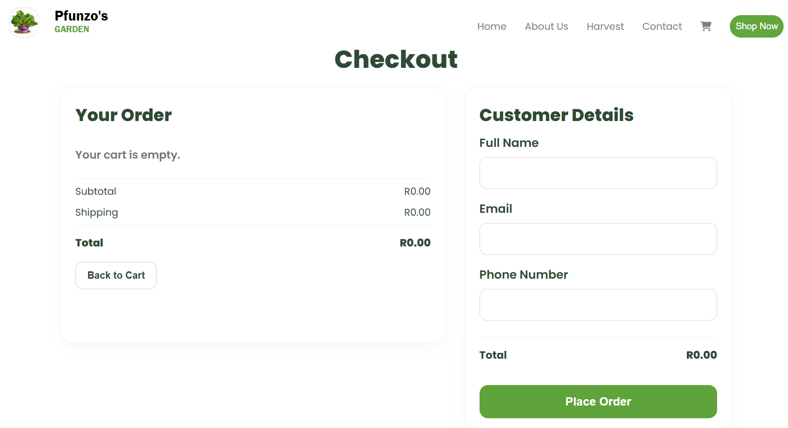

# 🌱 Pfunzo's Garden full stack

A full-stack e-commerce website for Pfunzo's Garden, a home-grown garden based in Thohoyandou, Limpopo, South Africa.

The website allows customers to browse available produce, add products to a shopping cart, provide their details during checkout, and place orders that are stored in a MySQL database.

## 🌿 Project Overview

Pfunzo's Garden E-commerce was developed to create an online platform where customers can view and order fresh vegetables, fruits, herbs and seedlings.

The project combines a responsive frontend with a PHP backend and MySQL database.
This project demonstrates my practical skills in web development, backend programming, and database integration.

## ✨ Features

- 🌱 Dynamic product listing
- 🥬 Vegetable, fruit, herb and seedling categories
- 🔎 Product category filtering
- 🛒 Shopping cart functionality
- ➕ Product quantity management
- 💾 Cart persistence using localStorage
- 📦 Product stock and availability information
- 👤 Customer details during checkout
- 🧾 Order summary
- 💰 Subtotal, shipping and total calculation
- 🗃️ Customer and order data stored in MySQL
- 📋 Order items linked to products
- 🔗 Relational database structure
- 📱 Responsive website design

## 🛠️ Technologies Used

### Frontend
- HTML5
- CSS3
- JavaScript

### Backend
- PHP

### Database
- MySQL

### Development Environment
- XAMPP
- Visual Studio Code
- Git & GitHub

## 🗂️ Database Structure

The project uses a relational MySQL database called `pfunzosgarden`.

Main tables include:

- `products` — stores available garden products
- `customers` — stores customer information
- `orders` — stores customer orders
- `order_items` — stores the products included in each order

The relationships allow an order to be connected to a customer and individual products.

### Main Database Operations

- Create and manage products
- Retrieve products dynamically using PHP
- Store customer information
- Create and manage customer orders
- Store individual order items
- Update product information
- Delete products
- Use foreign keys to maintain relationships
- Use SQL JOIN queries to retrieve related information
- Calculate order totals from stored order items

## 🛒 Shopping Cart and Checkout Flow

```text
Products
   ↓
Add to Cart
   ↓
Cart
   ↓
Checkout
   ↓
Customer Details
   ↓
Place Order
   ↓
PHP
   ↓
MySQL
```

## 📸 Screenshots

### Homepage


### Products / Harvest


### Shopping Cart


### Checkout


https://github.com/pfunzomaba/pfunzos-garden-fullstack/blob/main/screenshots/home%20page.png

## 🚀 Running the Project Locally

### Requirements

- XAMPP
- MySQL
- PHP
- Web browser

### Setup

1. Clone the repository:

```bash
git clone https://github.com/pfunzomaba/pfunzos-garden-fullstack.git
```

2. Move the project into:

```text
C:\xampp\htdocs\
```

3. Start Apache and MySQL using XAMPP.

4. Create a MySQL database named:

```text
pfunzosgarden
```

5. Import the required database tables.

6. Configure the PHP database connection for your local MySQL setup.

7. Open the project in your browser:

```text
http://localhost/pfunzos-garden/products.html
```

## 🔐 Database Configuration

The project uses PHP to connect to MySQL.

Update the database connection settings in the PHP database connection file according to your local environment.
### Note: The database must be created and configured locally. GitHub does not run PHP or provide a MySQL database for this project by default.###

## 📚 What I Learned

Through this project, I gained practical experience with:

- Building responsive web pages
- JavaScript DOM manipulation
- Working with localStorage
- Creating and managing MySQL databases
- Designing relational database tables
- Writing SQL queries and JOINs
- PHP and MySQL integration
- Sending data between JavaScript and PHP
- Processing customer orders
- Using Git and GitHub for version control

## 🔮 Future Improvements

Future versions could include:

- Deployment to a live PHP/MySQL hosting environment

## 👩🏽‍💻 Developer

**Pfunzo's Garden full stack**
Developed as a practical web development and database integration project.

License
This project is available for learning and portfolio demonstration. Contact the author before reusing project assets or content.
